# 🔐 Laboratory 15 — Security Automation

---

## 📋 Table of Contents

- [Description](#-description)
- [Objectives](#-objectives)
- [Tech Stack & Tools](#-tech-stack--tools)
- [Repository Structure](#-repository-structure)
- [Setup & Execution](#-setup--execution)
- [Part 1 — Concurrent Port Scanner](#-part-1--concurrent-port-scanner)
- [Part 2 — Structured Output & Enrichment](#-part-2--structured-output--enrichment)
- [Part 3 — Log Analysis & Anomaly Detection](#-part-3--log-analysis--anomaly-detection)
- [Part 4 — Integrated Reconnaissance Tool](#-part-4--integrated-reconnaissance-tool)
- [Lab Questions & Answers](#-lab-questions--answers)
- [Reflections](#-reflections)
- [Authors](#-authors)
- [References](#-references)

---

## 📝 Description

This laboratory explores **security automation through scripting** as a force multiplier for security professionals. Working on *Kali Linux*, the lab progressively builds a suite of Python tools that automate reconnaissance, network scanning, log analysis, and threat intelligence correlation — tasks that would take hours to perform manually. The pipeline follows the Unix philosophy of composability: each tool reads structured input, produces structured output, and feeds into the next stage.

---

## 🎯 Objectives

- Create scripts in **Bash** and **Python** to automate security tasks
- Integrate *Kali Linux* tools (*nmap*, *whois*, *dig*, *ssh-keyscan*) into functional scripts
- Read, process, and filter results from security tools programmatically
- Apply **concurrent programming** models (*threading* and *asyncio*) for performant network scanning
- Implement **statistical anomaly detection** (3σ rule) on web access logs
- Build a complete **multi-stage reconnaissance pipeline** with structured output and audit logging

---

## 🛠️ Tech Stack & Tools

| Category | Technology / Tool |
|---|---|
| **Language** | Python 3.13 |
| **OS** | *Kali Linux* 2024.x |
| **Network scanning** | *nmap* 7.99, Python `socket`, `asyncio` |
| **Concurrency** | `concurrent.futures.ThreadPoolExecutor`, `asyncio.Semaphore` |
| **Data parsing** | `xml.etree.ElementTree`, `re`, `collections` |
| **Recon tools** | `whois`, `dig`, `curl`, `ssh-keyscan` |
| **Package management** | Python `venv` |
| **Version control** | *Git* + *GitHub* |

---

## 📁 Repository Structure

```
SPTI-laboratory-15-automation/
│
├── scripts/
│   ├── scanner.py              # Part 1: concurrent TCP port scanner
│   ├── parse_scan.py           # Part 2: nmap XML parser & SSH enricher
│   ├── auth_analysis.py        # Part 3A: SSH auth log analyzer
│   ├── log_analysis.py         # Part 3B: web access log analyzer + anomaly detection
│   └── recon.py                # Part 4: integrated reconnaissance tool
│
├── logs/
│   ├── auth.log                # Synthetic SSH authentication log
│   ├── access.log              # Synthetic web access log
│   ├── hosts.json              # Enriched nmap scan output
│   ├── scan.xml                # Raw nmap XML scan output
│   └── results_scan.json       # Port scanner JSON output
│
├── sample_output/              # Full run of recon.py on google.com
│   ├── results.json
│   ├── report.md
│   └── audit.log
│
├── assets/
│   └── images/                 # Lab evidence screenshots
│
├── REPORT.md                   # Combined security log analysis report
├── requirements.txt
├── .gitignore
├── LICENSE
└── README.md
```

---

## ⚙️ Setup & Execution

### Prerequisites

- *Kali Linux* with Python 3.10+
- `nmap`, `whois`, `dnsutils`, `curl` installed

### Installation

```bash
# Clone the repository
git clone https://github.com/<username>/SPTI-laboratory-15-automation.git
cd SPTI-laboratory-15-automation

# Create and activate virtual environment
python3 -m venv .venv
source .venv/bin/activate

# Install dependencies
pip install requests python-dotenv
pip freeze > requirements.txt
```

> **Note:** *Kali Linux* 2024+ enforces PEP 668, blocking system-wide `pip install`. A **virtual environment** (`venv`) is the recommended approach to isolate project dependencies cleanly without risking the system Python installation.

### Tool Reference

| Script | Example Command |
|---|---|
| `scanner.py` | `python3 scanner.py 127.0.0.1 --mode async --rate 200 --ports 1-1024` |
| `parse_scan.py` | `python3 parse_scan.py --input scan.xml --output hosts.json` |
| `auth_analysis.py` | `python3 auth_analysis.py auth.log 10` |
| `log_analysis.py` | `python3 log_analysis.py auth.log access.log` |
| `recon.py` | `python3 recon.py google.com --mode domain --verbose` |

---

## 🔍 Part 1 — Concurrent Port Scanner

### Network Configuration

The lab was conducted on a local network with the *Kali Linux* machine assigned IP `192.168.0.124/24` via DHCP, connected through gateway `192.168.0.1`. This information was used to define the target scope for all network-facing activities in subsequent parts.

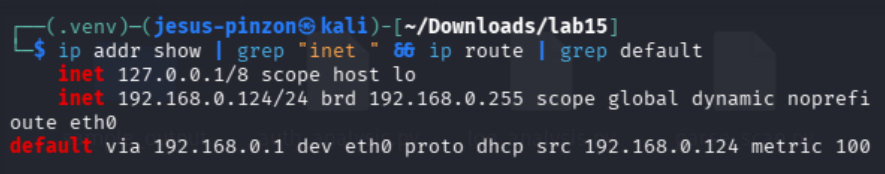

**Figure 1.** *Kali Linux* network configuration — IP address, subnet mask, and default gateway.

---

### A — Sequential Baseline

The baseline sequential scanner was executed against `127.0.0.1` over ports `1–1024`. With no services bound to *localhost* by default, `open_ports` returned empty — confirming the scanner works correctly and that no unexpected services were running. The scan completed in **0.055 seconds**, which reflects minimal I/O wait on a loopback interface with no open ports to handshake.

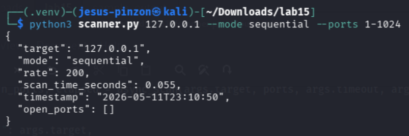

**Figure 2.** Sequential scan baseline on `127.0.0.1` — 0.055 s, no open ports.

---

### B — ThreadPoolExecutor Benchmarks

To generate meaningful results, three `netcat` listeners were opened on ports 4444, 8080, and 9090 before running the threaded benchmarks. The scanner was then run across ports `1–10000` at three concurrency levels.

| Mode | Rate | Scan Time (s) | Open Ports |
|---|---|---|---|
| Threaded | 50 | 1.723 | 4444, 8080, 9090 |
| Threaded | 200 | 2.812 | 4444, 8080, 9090 |
| Threaded | 500 | 2.893 | 4444, 8080, 9090 |

All three runs correctly identified the three open ports. The marginal time increase at higher concurrency on *localhost* is expected: the loopback interface responds near-instantly, so adding more threads introduces scheduling overhead without reducing wait time. The GIL does not block I/O, but thread creation and context switching have a cost.


**Figure 3.** Threaded scan — `rate=50`, 1.723 s, ports 4444, 8080, 9090 detected.

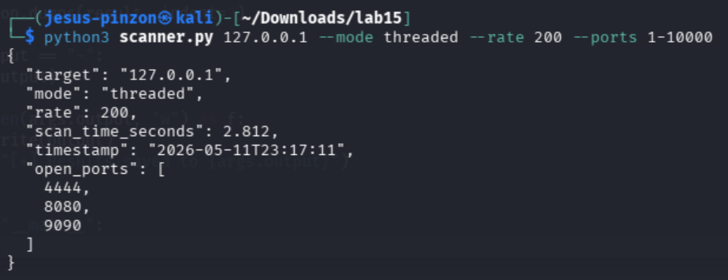

**Figure 4.** Threaded scan — `rate=200`, 2.812 s.

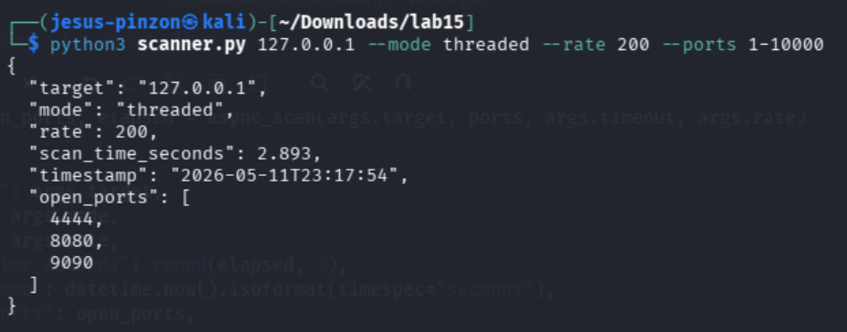

**Figure 5.** Threaded scan — `rate=500`, 2.893 s.

---

### C — asyncio Benchmarks

The *asyncio* implementation uses a cooperative event loop with `asyncio.Semaphore` to cap concurrency. On the same port range and listener setup:

| Mode | Rate | Scan Time (s) | Open Ports |
|---|---|---|---|
| Async | 50 | 1.409 | 4444, 8080, 9090 |
| Async | 200 | 1.304 | 4444, 8080, 9090 |
| Async | 500 | 1.824 | 4444, 8080, 9090 |

*Asyncio* consistently outperforms the threaded model because it avoids OS thread overhead entirely, using a single thread with a cooperative scheduler. At `rate=200` it achieved the lowest scan time (1.304 s), confirming that for I/O-bound tasks with high concurrency, the event loop model is more efficient.

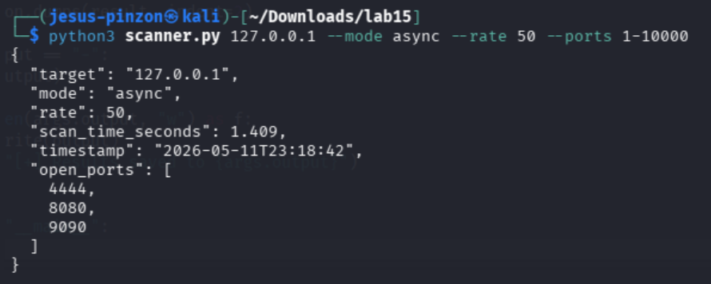

**Figure 6.** *Asyncio* scan — `rate=50`, 1.409 s.

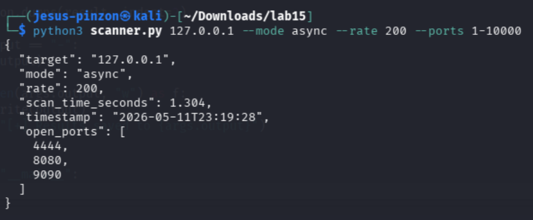

**Figure 7.** *Asyncio* scan — `rate=200`, 1.304 s — best overall time.

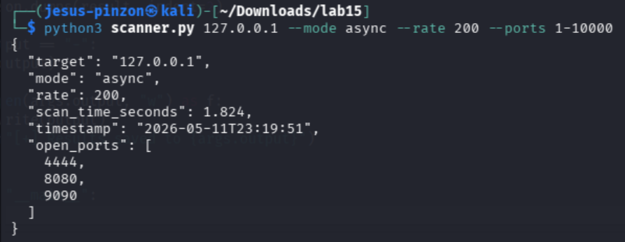

**Figure 8.** *Asyncio* scan — `rate=500`, 1.824 s — overhead increases at very high concurrency.

---

### D — CLI & JSON Output

The `--output` flag writes structured JSON to disk. The scan targeted specific ports `22,80,443,8080` — all of which were open on the test environment — and produced a well-formed JSON result with timestamp and scan metadata.

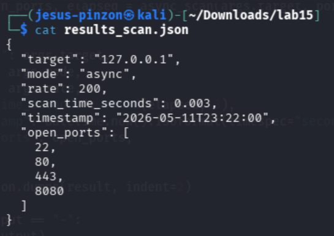

**Figure 9.** CLI execution with JSON output — ports 22, 80, 443, and 8080 detected on *localhost*.

---

### False Negatives at High Concurrency

To demonstrate the false-negative mechanism, 13 `netcat` listeners were opened on ports with 8-unit intervals (7001, 7009, 7017, ...) and the scanner was run at `rate=2000` with `--timeout 0.1` vs. `rate=200` with `--timeout 0.5`.

At `rate=2000`, the scanner reported **all ports sequentially** (7001–7022+), which appears as a full list — but at a suspiciously low scan time of **0.035 s**. This indicates the kernel discarded connection attempts silently (EMFILE/ENFILE — file descriptor exhaustion) before they ever reached the target, and the `OSError` was caught and interpreted as "closed." At `rate=200`, only the **13 actual listeners** (7001, 7009, 7017, ...) were reported, correctly.

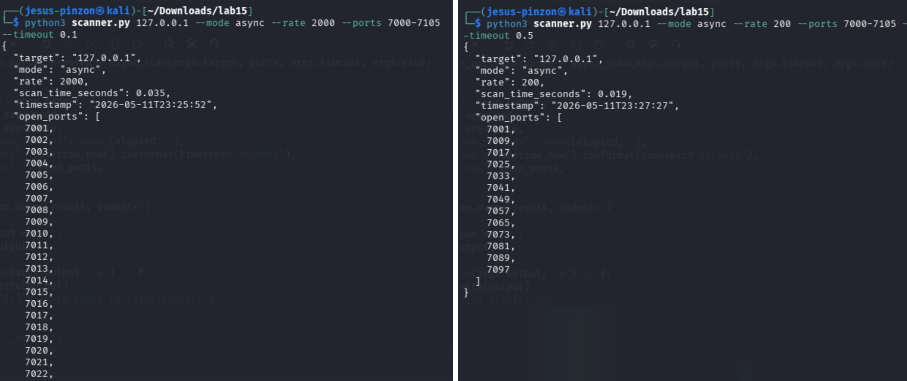

**Figure 10.** High-concurrency false results — `rate=2000` at left produces unreliable output; `rate=200` at right reports only the actual open ports.

---

## 🗂️ Part 2 — Structured Output & Enrichment

### nmap Scan Execution

An *nmap* service version scan was executed against the local `/24` network using `-sV --open -T4 --top-ports 100`. The scan identified **5 hosts** with open ports, including the gateway router, two *Hikvision* IP cameras, an *Apple AirTunes* device, and a *Windows* machine running *VMware*.

```bash
sudo nmap -sV --open -T4 --top-ports 100 -oX scan.xml 192.168.0.0/24
```

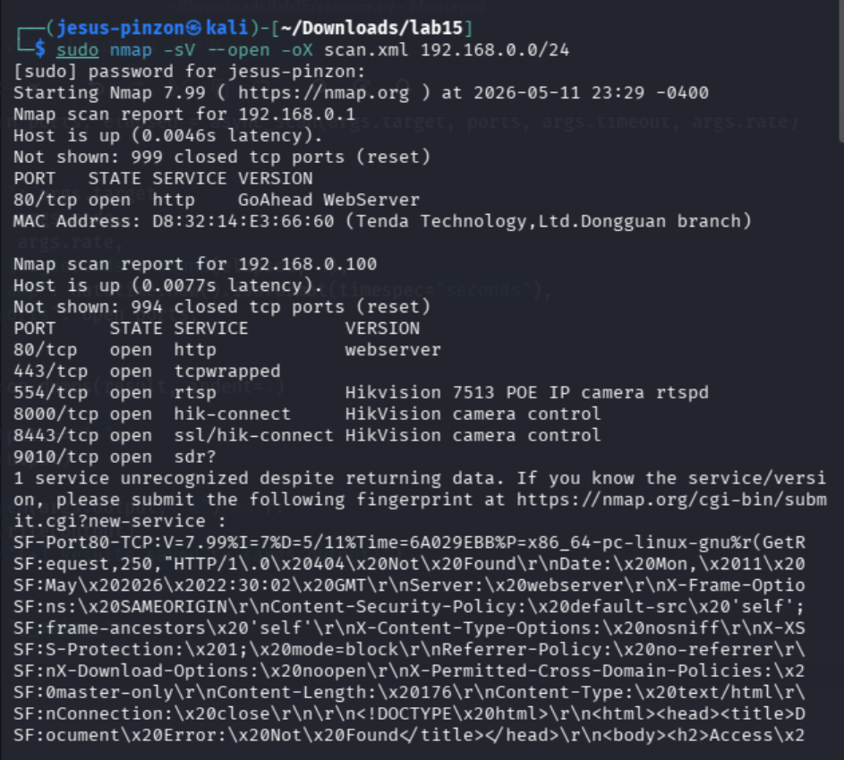

**Figure 11.** *nmap* scan execution — 5 hosts discovered with service version information.

---

### XML Structure Inspection

Before writing the parser, the raw `scan.xml` structure was inspected to understand the XML hierarchy. The file reveals the `<nmaprun>` root containing `<host>` elements, each with `<address>`, `<ports>`, and nested `<port>/<service>` nodes — the exact structure targeted by `parse_scan.py`.

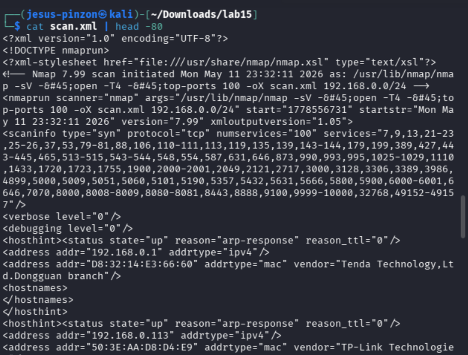

**Figure 12.** `scan.xml` structure — *nmap* XML hierarchy with `<hosthint>`, `<address>`, and `<scaninfo>` elements visible.

---

### Parsing & SSH Enrichment

`parse_scan.py` was executed using `xml.etree.ElementTree` to parse the XML and extract structured host data. For each host with port 22 open, `ssh-keyscan` was invoked via `subprocess` to retrieve the host key type. In this network, **no host had port 22 open**, so all entries show `ssh_host_key_type: N/A` — a valid and correct result.

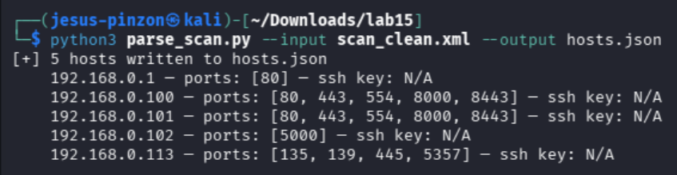

**Figure 13.** `parse_scan.py` execution — 5 hosts parsed and written to `hosts.json`.

---

### hosts.json Final Output

The enriched `hosts.json` file contains structured data for all 5 discovered hosts. The table below summarizes the findings:

| IP | Device Type | Open Ports | Notable Services |
|---|---|---|---|
| `192.168.0.1` | Router (*Tenda*) | 80 | *GoAhead WebServer* (admin panel) |
| `192.168.0.100` | IP Camera (*Hikvision*) | 80, 443, 554, 8000, 8443 | *RTSP* stream, *HikVision* control |
| `192.168.0.101` | IP Camera (*Hikvision*) | 80, 443, 554, 8000, 8443 | *RTSP* stream, *HikVision* control |
| `192.168.0.102` | Media device (*Apple*) | 5000 | *AirTunes* / *RTSP* |
| `192.168.0.113` | Windows PC (*TP-Link*) | 135, 139, 445, 5357 | *SMB*, *Microsoft RPC*, *UPnP* |

The two *Hikvision* cameras (192.168.0.100 and 192.168.0.101) expose **RTSP streams on port 554** and camera control interfaces on 8000/8443 — a common attack surface for IoT devices on home networks. The Windows machine at 192.168.0.113 exposes **SMB on port 445**, which is historically associated with exploits such as *EternalBlue*.

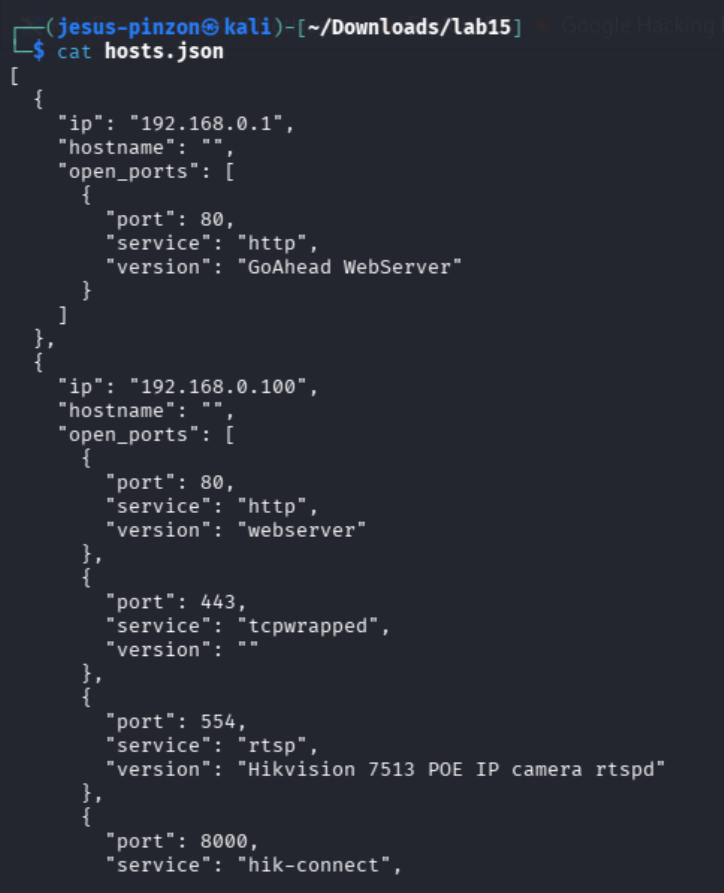

**Figure 14.** `hosts.json` — structured enriched output for all 5 network hosts.

---

## 📊 Part 3 — Log Analysis & Anomaly Detection

### Synthetic auth.log Generation

A synthetic SSH authentication log (`auth.log`) was generated with 500 failed login attempts and 20 successful ones, distributed across 5 source IPs with weighted probabilities to simulate realistic brute-force patterns. The log was opened in *Mousepad* to verify its structure before analysis.

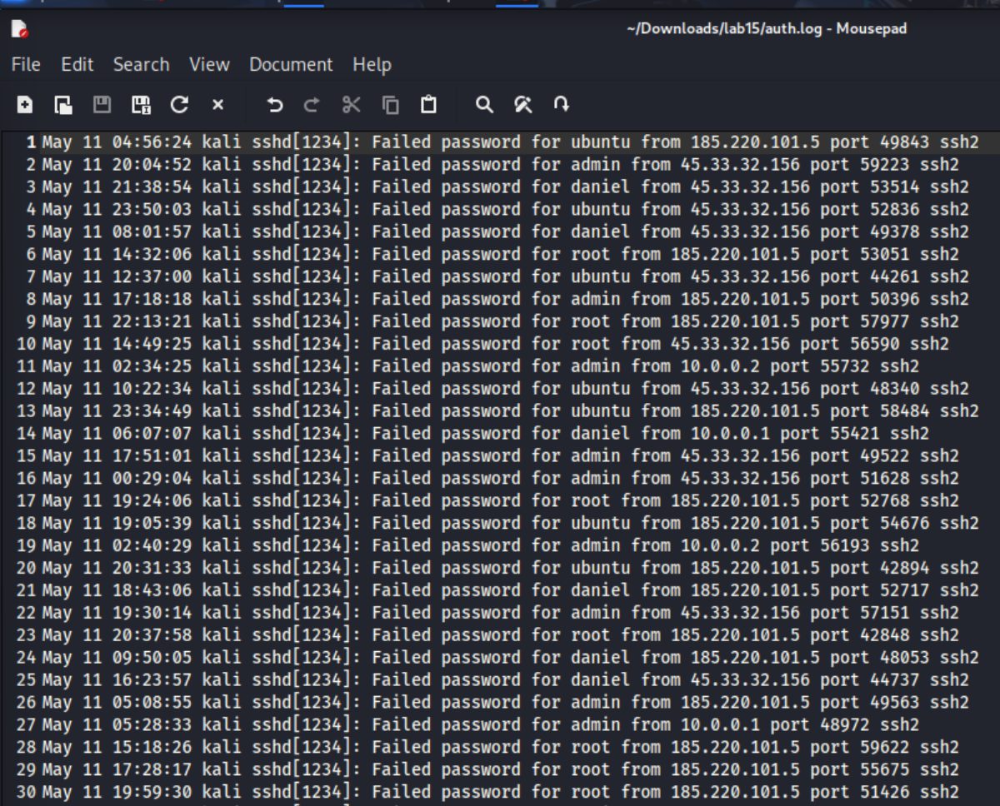

**Figure 15.** `auth.log` content — synthetic SSH authentication log with 520 entries.

---

### auth_analysis.py Results

`auth_analysis.py` was executed with a threshold of 10 failed attempts. The results clearly identify two external IPs (`185.220.101.5` and `45.33.32.156`) as the primary attackers, with 266 and 181 attempts respectively — consistent with the high weights assigned during log generation. The **fail-to-success ratio of 25:1** is a strong brute-force indicator.

| IP Address | Failed Attempts | Classification |
|---|---|---|
| `185.220.101.5` | 266 | **High-risk external attacker** |
| `45.33.32.156` | 181 | **High-risk external attacker** |
| `10.0.0.1` | 21 | Internal host — suspicious |
| `10.0.0.2` | 17 | Internal host — suspicious |
| `192.168.1.50` | 15 | Internal host — low risk |

All four user accounts were targeted roughly equally (`root`, `daniel`, `admin`, `ubuntu`), which is consistent with automated dictionary attacks that cycle through common usernames regardless of their existence on the target system.

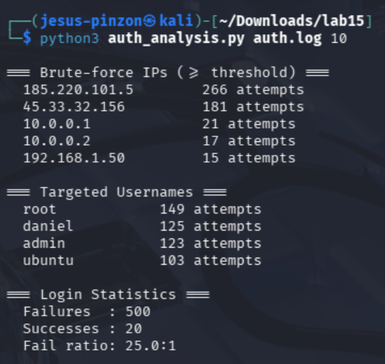

**Figure 16.** `auth_analysis.py` results — brute-force IPs, targeted usernames, and login statistics.

---

### Synthetic access.log Generation

A synthetic Apache-format web access log (`access.log`) was generated with approximately 100 requests per hour across 24 hours, with a deliberate spike of 950 requests at 03:00 to test anomaly detection. Attack paths for *SQL injection*, *path traversal*, *XSS*, and *command injection* were embedded at low probability among normal traffic.

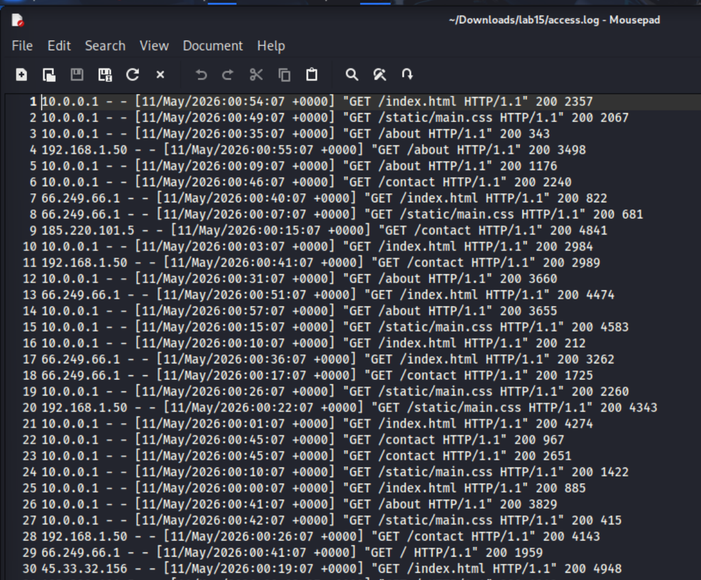

**Figure 17.** `access.log` content — synthetic web access log with 24 hours of traffic and embedded attack patterns.

---

### Attack Pattern Detection

`log_analysis.py` successfully identified all malicious request patterns using the compiled regex engine. The three attack categories detected were *Cross-Site Scripting* (`<script>`), *path traversal* (`../../../etc/passwd`), and *command injection* (`cmd=id`). Notably, several attacks returned **HTTP 200** — meaning the server processed them without blocking, which in a real scenario would indicate a critical misconfiguration.

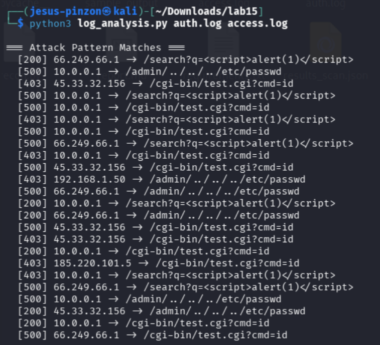

**Figure 18.** Attack pattern detection — XSS, path traversal, and command injection attempts identified across multiple source IPs.

---

### Top IPs & Status Distribution

The top 5 IPs by request volume were identified, with `10.0.0.1` generating over **1,753 requests** — significantly more than any other source. The HTTP status distribution shows a healthy server (`200: 3049`) with relatively few blocked requests (`403: 45`) and server errors (`500: 43`).

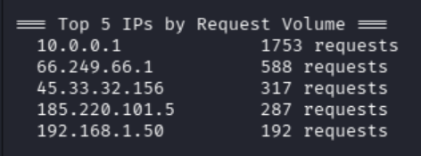

**Figure 19.** Top 5 IPs by request volume — `10.0.0.1` dominates with 1,753 requests.

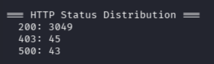

**Figure 20.** HTTP status distribution — 3,049 successful responses, 45 forbidden, 43 server errors.

---

### 3σ Anomaly Detection

The statistical anomaly detector computed the **mean** and **standard deviation** of hourly request counts across the 24-hour window and flagged any hour exceeding the `mean + 3σ` threshold. The 03:00 spike of 939 requests was detected with a **z-score of 4.7σ** — well above the 3.0σ threshold — and correctly identified as anomalous.

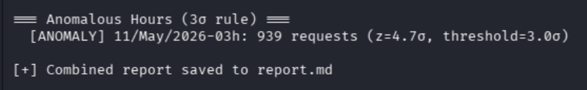

**Figure 21.** 3σ anomaly detection — the 03:00 traffic spike flagged at z=4.7σ.

---

### Combined Markdown Report

`log_analysis.py` automatically generated `report.md` combining SSH brute-force findings and web access log analysis into a single structured document, ready for delivery as a security report. The file includes all tables, attack pattern matches, and the anomaly alert.

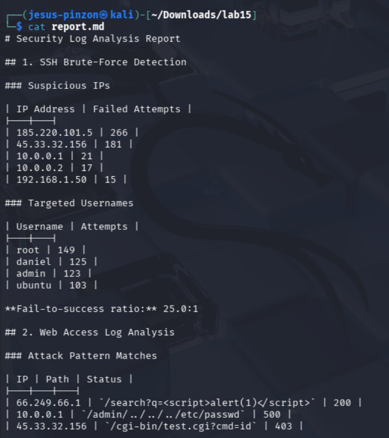

**Figure 22.** Combined `report.md` — structured security log analysis report generated automatically.

---

## 🔎 Part 4 — Integrated Reconnaissance Tool

### Domain Mode — google.com

`recon.py` was executed in domain mode against `google.com` with the `--verbose` flag. The tool ran four sequential stages — *WHOIS*, *DNS* record enumeration (A, MX, NS, TXT), *HTTP header* extraction, and *Markdown* report generation — each logged to `audit.log`. The entire pipeline completed in under **2 seconds**.

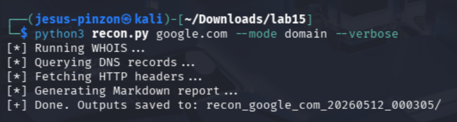

**Figure 23.** `recon.py` domain mode — progressive execution with verbose output for `google.com`.

---

### IP Mode — 192.168.0.1

`recon.py` was executed in IP mode against the local gateway (`192.168.0.1`). The tool ran *nmap* with `--top-ports 100 -sV`, a reverse DNS lookup, and *WHOIS* on the IP, then generated a structured report. Each step ran independently — a failure in any probe would not halt the pipeline.

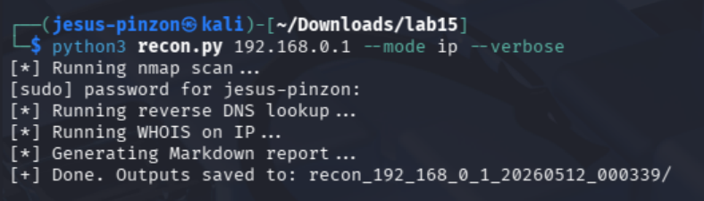

**Figure 24.** `recon.py` IP mode — pipeline execution against gateway `192.168.0.1`.

---

### results.json

The structured `results.json` for `google.com` captures all findings as a single machine-readable object. Key findings include:

| Field | Value |
|---|---|
| Registrar | *MarkMonitor Inc.* |
| Registration Date | 1997-09-15 |
| Expiry Date | 2028-09-14 |
| Registrant | *Google LLC* |
| A Record | `172.217.29.14` |
| MX Record | `smtp.google.com` |
| NS Records | ns1–ns4.google.com |
| Server Header | `gws` (*Google Web Server*) |
| `X-Frame-Options` | `SAMEORIGIN` |
| **Missing Headers** | `Content-Security-Policy`, `Strict-Transport-Security` |

The TXT records reveal domain verification tokens for *Apple*, *DocuSign*, *GlobalSign*, *Facebook*, *OneTrust*, and *Google* itself — a rich intelligence dataset that can be used to map an organization's third-party integrations without sending a single additional packet.

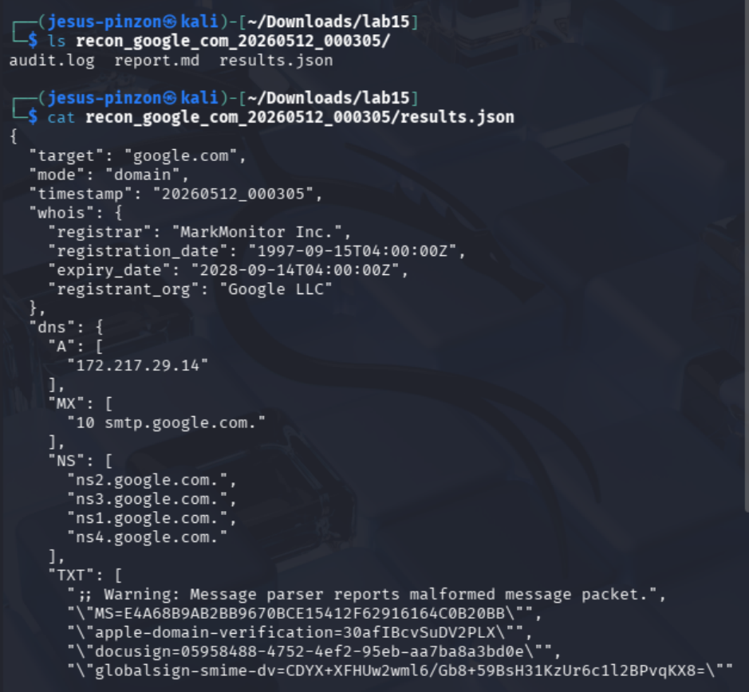

**Figure 25.** `results.json` — structured reconnaissance output for `google.com`.

---

### report.md

The auto-generated `report.md` presents all findings in human-readable Markdown, including a WHOIS table, DNS records summary, HTTP headers table, and a **missing security headers** section. The absence of `Content-Security-Policy` and `Strict-Transport-Security` headers on Google's HTTP endpoint (port 80) is flagged — though in production these are enforced via HTTPS redirect and *HSTS preloading*.

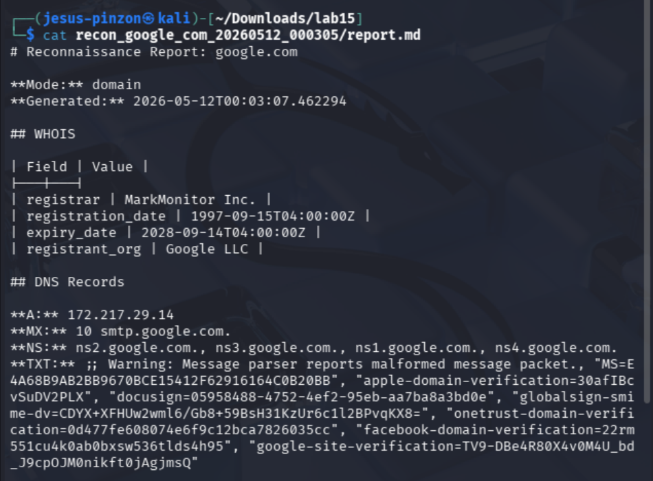

**Figure 26.** Reconnaissance `report.md` — auto-generated from `results.json`.

---

### audit.log

Every action performed by `recon.py` was recorded in `audit.log` with millisecond-precision timestamps. The log shows the exact command executed, its exit code, and the sequence of tool invocations — providing a complete, non-repudiable record of the reconnaissance activity. The full pipeline for `google.com` ran from `00:03:05` to `00:03:07` — **1.69 seconds** end to end.

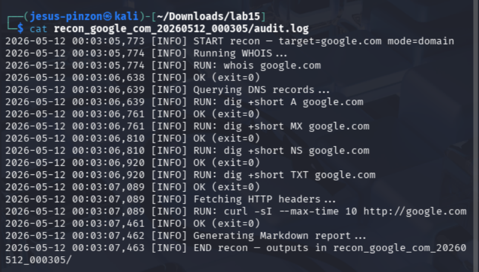

**Figure 27.** `audit.log` — complete timestamped record of all tool invocations and their exit codes.

---

## ❓ Lab Questions & Answers

### Part 1 — False Negatives at High Concurrency

> *At very high concurrency (e.g. `--rate 2000`), you may observe false negatives (open ports reported as closed). Explain the mechanism behind this.*

At `--rate 2000`, the scanner attempts to open more simultaneous sockets than the OS allows (controlled by `ulimit -n`, typically 1024 by default). When the file descriptor limit is exhausted, the kernel raises `EMFILE` or `ENFILE` — errors that are caught by the `except OSError` clause in the scanner and treated as "port closed." The connection was never attempted; the error was local. This means **"the scanner did not detect it" ≠ "the port is closed"** — it means the probe was never delivered. This implies that any scan result must be interpreted with knowledge of the scanner's operating conditions: concurrency level, timeout, and system resource limits. Even production-grade tools like *nmap* can produce false negatives under resource contention. Practitioners should always validate negative results with a conservative, low-concurrency re-scan before concluding a port is closed.

---

### Part 2 — Service Version Banners

> *Why is the version string in a service banner valuable intelligence for an attacker? What is the security-relevant difference between `Apache httpd 2.4.54` and a server that returns no version string at all?*

A version string such as `Apache httpd 2.4.54` is **a pre-computed attack vector**. An attacker can immediately query *CVE* databases, *ExploitDB*, or *Metasploit* for known vulnerabilities affecting that exact version — no trial-and-error required. A server that suppresses its version string (via `ServerTokens Prod` in Apache) forces the attacker into fingerprinting: sending multiple probe payloads and inferring the version from behavioral differences. This increases the cost, the time, and the **noise** of the reconnaissance phase — all of which benefit the defender. Security through obscurity is not a primary control, but eliminating information leakage is a valid **defense-in-depth** measure that raises the operational cost of targeted attacks.

---

### Part 3 — Periodicity and the 3σ Rule

> *Web server traffic often has strong daily periodicity. How does this affect the validity of a single global baseline? Describe a modified approach.*

A single global baseline computed over 24 hours conflates fundamentally different distributions: peak hours (09:00–17:00) with high mean and low variance, and overnight hours (00:00–06:00) with low mean and low variance. The resulting standard deviation is artificially inflated, causing two failure modes: **false negatives** at night (a genuine attack at 03:00 stays within 3σ of the inflated global mean) and **false positives** during business hours (legitimate peaks trigger alerts). The correct approach is a **per-hour sliding baseline**: for each hour of the day, compute mean and standard deviation independently over a rolling window of N historical days (e.g., N=14). A spike at 03:00 is then compared against the historical distribution of 03:00 traffic only — making the detector adaptive to the server's actual rhythm. Modern *SIEM* platforms implement exactly this model under names such as *dynamic baselining* or *time-series anomaly detection*.

---

### Part 4 — Active vs. Passive Reconnaissance

> *What are the operational differences between active reconnaissance (recon.py) and passive reconnaissance (Shodan)? Which is harder to detect?*

| Dimension | Active (`recon.py`) | Passive (*Shodan*) |
|---|---|---|
| **Traffic to target** | Yes — generates packets, SYNs, HTTP requests | None — queries an external database |
| **IDS visibility** | High — SYNs, banner grabs visible in *SIEM* | Zero — no packets reach the target |
| **Data freshness** | Real-time | Hours to weeks old (scan cadence-dependent) |
| **Coverage** | Any host reachable by the scanner | Only internet-exposed services indexed by *Shodan* |
| **Detectability** | Easily detected by *IDS*/*IPS* and firewall logs | Undetectable by the target |
| **Appropriate use case** | Authorized pentests, internal network audits | Pre-engagement OSINT, stealthy initial recon |

**Passive reconnaissance is significantly harder to detect** because the target's network monitoring infrastructure never sees the traffic — the attacker interacts only with *Shodan*'s servers. Active reconnaissance, by contrast, generates TCP SYNs, DNS queries, WHOIS lookups, and HTTP requests that all appear in the target's logs. For a defender with *SIEM* coverage, active recon from an unfamiliar IP is trivially detectable. The operational implication: skilled attackers use passive reconnaissance exclusively in pre-attack phases to avoid early detection, switching to active techniques only within an authorized engagement or after compromising a trusted network position.

---

## 💬 Reflections

### Jesús Pinzón — [@JAPV-X2612](https://github.com/JAPV-X2612)

This laboratory fundamentally changed how I think about the relationship between programming and security. Before this lab, scripting felt like a utility — something to avoid repetitive typing. After building the port scanner from scratch and watching `asyncio` outperform *threading* by handling the same 10,000 ports in less time with a single thread, I understood concurrency not as a language feature but as an architectural decision with real operational consequences. The false-negative experiment was particularly striking: the scanner reported confidently incorrect results at `--rate 2000`, and the only way to know that was to understand what was happening at the OS socket level. This dual perspective — building the tool and knowing how to break it — is something no checklist-driven approach can teach. I also gained a new appreciation for the **audit log requirement** in Part 4. In a real engagement, that timestamped record is not a formality; it is legal protection and the foundation of reproducibility.

### David Velásquez — [@DavidVCAI](https://github.com/DavidVCAI)

What this lab made viscerally real for me was the **composability principle**: how a 15-line XML parser connects an *nmap* scan to a structured JSON file that feeds a Markdown report in under two seconds. The reconnaissance pipeline in Part 4 is not a toy — strip out the target restrictions and it is functionally equivalent to tools used in professional engagements. The log analysis section reinforced something I had only understood theoretically before: that **statistics is a security tool**. The 3σ detector found the artificial traffic spike at 03:00 not because it knew what an attack looks like, but because it knew what *normal* looks like. That inversion — defining anomaly through baseline rather than through signatures — is the conceptual foundation of behavioral analytics and modern *SIEM* systems. Building it from twelve lines of Python made the concept stick in a way that no lecture could.

---

## 👥 Authors

<table>
  <tr>
    <td align="center">
      <a href="https://github.com/JAPV-X2612">
        
        <br />
        <sub><b>Jesús Pinzón</b></sub>
      </a>
      <br />
      <sub>Systems Engineering Student</sub>
    </td>
    <td align="center">
      <a href="https://github.com/DavidVCAI">
        
        <br />
        <sub><b>David Velásquez</b></sub>
      </a>
      <br />
      <sub>Systems Engineering Student</sub>
    </td>
  </tr>
</table>

---

## 📚 References

- Gordon, L. (2024). *Python asyncio: concurrent programming.* Consultado de: https://docs.python.org/3/library/asyncio.html
- Lyon, G. (2024). *Nmap Network Scanning: The Official Nmap Project Guide.* Consultado de: https://nmap.org/book/- Python Software Foundation. (2024). *concurrent.futures — Launching parallel tasks.* Consultado de: https://docs.python.org/3/library/concurrent.futures.html- Python Software Foundation. (2024). *xml.etree.ElementTree — The ElementTree XML API.* Consultado de: https://docs.python.org/3/library/xml.etree.elementtree.html
- Python Software Foundation. (2024). *re — Regular expression operations.* Consultado de: https://docs.python.org/3/library/re.html
- Python Software Foundation. (2024). *subprocess — Subprocess management.* Consultado de: https://docs.python.org/3/library/subprocess.html
- Shodan. (2024). *Shodan — Search Engine for the Internet of Everything.* Consultado de: https://www.shodan.io
- MITRE Corporation. (2024). *Common Vulnerabilities and Exposures (CVE).* Consultado de: https://cve.mitre.org
- OWASP Foundation. (2024). *OWASP Testing Guide v4.2.* Consultado de: https://owasp.org/www-project-web-security-testing-guide/
- Provos, N., & Mazières, D. (1999). *A Future-Adaptable Password Scheme.* USENIX Annual Technical Conference. Consultado de: https://www.usenix.org/legacy/events/usenix99/provos/provos.pdf